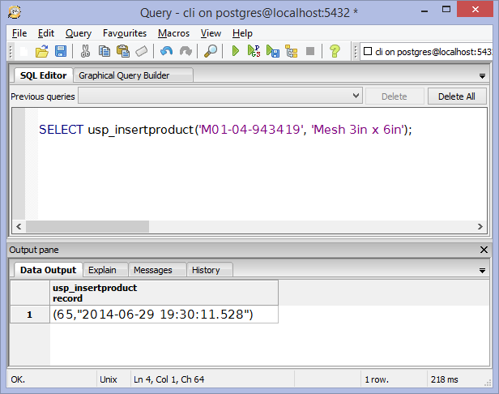

# Obteniendo output parameters de procedimientos PLSQL en PostgreSQL con .NET
		

En .NET existen dos maneras sencillas de ejecutar una procedimiento PLpgSQL y obtener la información como resultado de su ejecución.

La primera de ellas consiste en utilizar parámetros de salida <i>(output parameters)</i> como argumentos del procedimiento. 

Para mostrarles esta manera, en el siguiente código declaro cuatro argumentos para el procedimiento, dos de ellos como parámetros de entrada y dos de ellos como parámetros de salida.

	

 

Similar a las funciones o los métodos en otros lenguajes de programación, los procedimientos PlpgSQL son subprogramas que pueden recibir parámetros de entrada (input), salida (output) y ejecutar otros procedimientos, ademas de contar con expresiones para el control del flujo.

Los procedimientos aceptan <i>input parameters</i> (parámetros de entrada), que se utilizan dentro del store procedure como variables locales. También puedes especificar <i>output parameters</i> (parámetros de salida) que permiten que un procedimiento regrese uno o más valores escalares a la rutina que llamo ese procedimiento. Cuando se ejecuta el procedimiento los valores de los parámetros de salida son almacenados en memoria.

Para demostrar su funcionalidad, creo una tabla llamada <i>Products</i> con el siguiente script.

 

Inserto unos registros de prueba y los ordeno por la columna <i>id</i> de forma descendente de manera que pueda saber cual es el máximo id que me regresá el procedimiento.

 

Ahora ejecuto el procedimiento, poniéndole valores a sus parámetros. Al terminar su ejecución el procedimiento devolverá el máximo id y la fecha en la que se inserto el registro, estos valores corresponden a sus dos parámetros <i>output</i>.

<pre>
SELECT usp_insertproduct('M01-04-943419', 'Mesh 3in x 6in');
</pre>

 

Al ejecutar este programa tecleamos el código y el nombre del producto.

 

Al terminar su ejecución, nos mostrará los valores de los parámetros de salida.

 

En el arreglo de parámetros definimos los de entrada y de salida. De manera predeterminada todos los parámetros son de entrada excepto los que explícitamente se asignan como salida:

<pre>
            parameters[2] = new NpgsqlParameter("p_id", p_id);
            parameters[3] = new NpgsqlParameter("p_created",p_created);
            parameters[2].Direction = ParameterDirection.Output;
            parameters[3].Direction = ParameterDirection.Output;
</pre>

Agregamos los parámetros y ejecutarmos el procedimiento

<pre>
            cmd.Parameters.AddRange(parameters);
            cmd.ExecuteNonQuery();
</pre>

Después asignamos los parámetros a variables en C#, para su manipulación en el programa.

<pre>
       p_id = Convert.ToInt32(cmd.Parameters["p_id"].Value);
       p_created = Convert.ToDateTime(cmd.Parameters["p_created"].Value);
</pre>

Los <i>output parameters</i> son considerados la mejor opción para regresar valores escalares.

